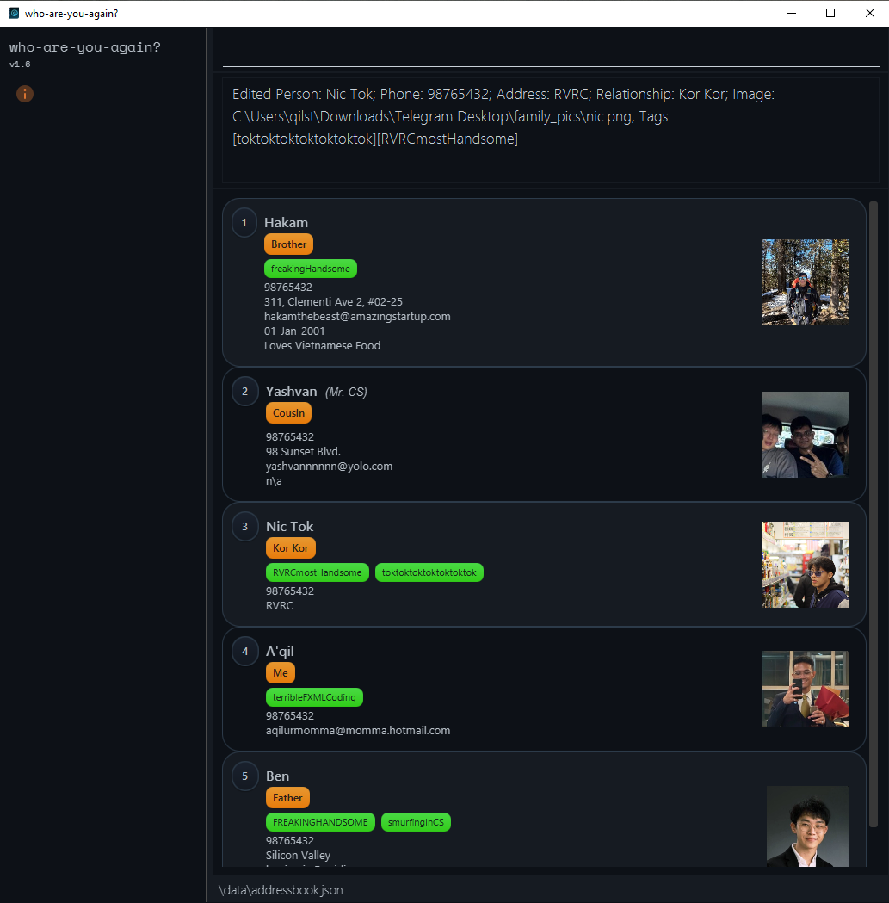
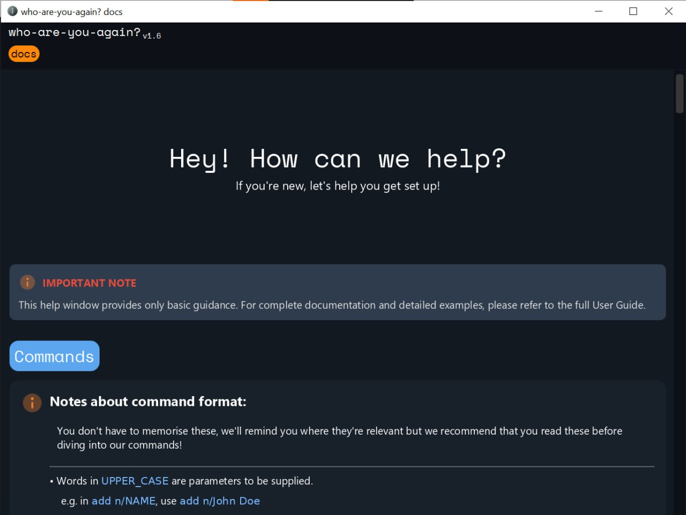

# WhoAreYouAgain? User Guide

**WhoAreYouAgain?** is a **desktop application** for managing your family contacts, optimized for use via a **Command Line Interface (CLI)** while still offering the benefits of a **Graphical User Interface (GUI)**. If you can type fast, WhoAreYouAgain? helps you keep track of relatives and birthdays more efficiently than traditional address book apps—so you’ll never awkwardly forget a name at reunions again.

<!-- * Table of Contents -->
<page-nav-print />

--------------------------------------------------------------------------------------------------------------------

## Quick start

1. Ensure you have Java `17` or above installed in your Computer.<br>
   **Mac users:** Ensure you have the precise JDK version prescribed [here](https://se-education.org/guides/tutorials/javaInstallationMac.html).

1. Download the latest `.jar` file from [here](https://github.com/AY2425S2-CS2103T-T14-1/tp/releases).

1. Copy the file to the folder you want to use as the _home folder_ for your AddressBook.

1. Open a command terminal, `cd` into the folder you put the jar file in, and use the `java -jar whoareyouagain.jar` command to run the application.<br>
   A GUI similar to the below should appear in a few seconds. Note how the app contains some sample data.<br>
   <br>
   
    <br>
1. Type the command in the command box and press Enter to execute it. e.g. typing **`help`** and pressing Enter will open the help window.<br>
   Some example commands you can try:

   * `list` : Lists all contacts.

   * `add n/Nickie p/88888888 r/son e/nickie@gmail.com a/21 Lower Kent Ridge Rd, Singapore 119077 nn/nickelodeon b/2001-01-01 no/My favorite son` : Adds a relative named `Nickie` to the family book.

   * `delete 3` : Deletes the 3rd contact shown in the current list.

   * `clear` : Deletes all contacts.

   * `exit` : Exits the app.

1. Refer to the [Features](#features) below for details of each command.

--------------------------------------------------------------------------------------------------------------------

## Key Features at a Glance

- ✅ **Speed meets simplicity**: Fast command-line input for power users, with a clean GUI for ease of use
- 🔁 **Command history navigation**: Use ↑ and ↓ arrows to recall past commands effortlessly
- 🗑️ **Confirmable actions**: Commands like `delete` and `clear` require confirmation to prevent accidents
- 🖼️ **Image support with GUI editing**: Add `.png` profile pictures using `img/` in commands, or click the photo in the GUI to update it instantly
- 📆 **Smart birthday sorting**: Use `list s/asc` or `list s/desc` to sort contacts by upcoming or distant birthdays
- 💬 **Fuzzy name search**: Automatically suggests similar names when no exact match is found
- ↩️ **Undo/Redo support**: Mistyped a command? Use `undo` and `redo` to step backward or forward through changes

---

# Features

<box type="info" seamless>

**Notes about the command format:**<br>

* Words in `UPPER_CASE` are the parameters to be supplied by the user.<br>
  e.g. in `add n/NAME`, `NAME` is a parameter which can be used as `add n/John Doe`.

* Items in square brackets are optional.<br>
  e.g `n/NAME [e/EMAIL]` can be used as `n/John Doe e/johnDoe@gmail.com` or as `n/John Doe`.

* Items with `…`​ after them can accept multiple values.<br>
  e.g. `delete…​` can be used as `delete 1`, `delete 1 2 4`, etc.

* Parameters can be in any order.<br>
  e.g. if the command specifies `n/NAME p/PHONE_NUMBER`, `p/PHONE_NUMBER n/NAME` is also acceptable.

* Extraneous parameters for commands that do not take in parameters (such as `help`, `exit` and `clear`) will be ignored.<br>
  e.g. if the command specifies `help 123`, it will be interpreted as `help`.

</box>
<box type="warning" seamless>
📎 <strong>Copying tip</strong>: If you're using a PDF, beware of line breaks when copying multi-line commands. Spaces may get lost!
</box>

---
## 📥 Managing Contacts

### Adding a person: `add`

Adds a person to the address book.

Format: `add n/NAME [p/PHONE_NUMBER] [e/EMAIL] [a/ADDRESS] [r/RELATIONSHIP] [nn/NICKNAME] [b/BIRTHDAY] [no/NOTES] [img/IMAGE_PATH] [t/TAG_1] [t/TAG_2] ... [t/TAG_10]`

<box type="tip" seamless>
See the [Person Fields Summary](#person-fields-summary) for complete details on all fields.
</box>

#### Name Requirements
✔ **Max 150 characters**<br>
✔ **Must start with a letter**<br>
✔ **Can contain letters, numbers, spaces and allowed special characters**<br>
✔ **Allowed special characters:** `@`, `.`, `,`, `!`, `'`, `/`, `-`<br>
✔ **No consecutive special characters** (e.g. `--`, `@@`, `..`)<br>
✔ **Cannot start or end with special characters**<br>


#### Image Support:
✔ **Only `.png` supported for now**  
✔ **Use `img/<IMAGE_PATH>` to specify the image path**  
✔ **Image path must be absolute**  
<small>*(An absolute path is the full location from the system root, e.g. `/Users/alex/images/photo.png`)*</small>


<box type="tip" seamless>
Mac Tip: Use <code>pwd</code> in terminal to get full working directory
</box>

<br>

Examples:
```
add n/Nickie p/88888888 r/son 
    e/nickie@gmail.com 
    a/21 Lower Kent Ridge Rd, Singapore 119077 
    nn/nickelodeon 
    b/01-01-2001
    no/My favorite son 
    img//Users/nickie/sleep.png 
    t/son
```
```
add n/Betsy Crowe p/99999999 r/Other 
    e/betsycrowe@example.com 
    a/Newgate Prison 
    b/30-03-2001 
    no/Son's girlfriend
```

### Editing a person : `edit`

Edits an existing person in the address book.

**Format:** `edit INDEX [n/NAME] [p/PHONE_NUMBER] [e/EMAIL] [a/ADDRESS] [r/RELATIONSHIP] [nn/NICKNAME] [b/BIRTHDAY] [no/NOTES] [img/IMAGE_PATH] [t/TAG]…​`

* Edits the person at the specified `INDEX`. <small>(This is the number shown next to each contact in the list.)<small>
* At least one of the optional fields must be provided.
* Existing values will be updated to the input values.
* When editing tags, the existing tags of the person will be removed i.e adding of tags is not cumulative.
* You can remove all the person’s tags by typing `t/` without
  specifying any tags after it.

**Examples:**
*  `edit 1 p/91234567 e/johndoe@example.com`   
    Edits the phone number and email address of the 1st person to be `91234567` and `johndoe@example.com` respectively.
</br>
</br>
*  `edit 2 n/Betsy Crower t/`   
    Edits the name of the 2nd person to be `Betsy Crower` and clears all existing tags.

<box type="tip" seamless> To <strong>remove</strong> any optional field (e.g. nickname or birthday), simply leave the value blank. 
</br>E.g. to remove a nickname: <code>edit 2 nn/</code> </box>

### Deleting a person: `delete`

Deletes the specified person(s) from the address book.

**Format:** `delete INDEX…​`

* Deletes the person(s) at the specified `INDEX` values.
* The index refers to the index number shown in the displayed person list.
* The index **must be a positive integer** (e.g. 1, 2, 3, …).
* Supports deleting multiple people at once (e.g. `delete 1 2 4`).

**Examples:**
* `list` followed by `delete 2` deletes the 2nd person in the address book.
* `find Betsy` followed by `delete 1 3` deletes the 1st and 3rd persons in the results of the `find` command.


### Listing all persons : `list`

Shows a list of all persons in the family book.

**Format:**
- `list` - Sorted by insertion order
- `list s/asc` — Sorted by closest upcoming birthday<br>
    <br>
   <br>
    <br>
- `list s/desc` — Sorted by farthest upcoming birthday <br>
  <br>
   <br>
    <br>
  
<box type="warning" seamless>
When you edit a person's birthday while viewing a birthday-sorted list (`list s/asc` or `list s/desc`), the order of people in the list will update automatically based on the new birthday information. This might cause the edited person to appear in a different position in the list. Use `list` to restore the original order (before sorting).
</box>

---

## 🔍 Searching
### Locating persons by name: `find`

Finds persons whose names match any of the given keywords. If no exact or partial matches are found, the app will automatically attempt a fuzzy search to suggest similar names.

**Format:** `find KEYWORD [MORE_KEYWORDS]`

* Performs an exact and partial match search first.
  If no results are found, a fuzzy search will suggest similar names instead.   
  E.g. `find Jon` can return names like `John`, `Jonathan`, or `Joni`.
* The search is case-insensitive.  
  E.g. `find hans` will match `Hans`
* The order of the keywords does not matter.  
  E.g. `find Hans Bo` will match `Bo Hans`
* Only the name is searched.
* Prefix matching. `find Ber` will match `Bertha`, `Bernice`, `Bern` etc.
* Persons matching at least one keyword will be returned (i.e. `OR` search).  
  E.g. `Hans Bo` will return `Hans Gruber`, `Bo Yang`

**Examples:**
* `find Jon` returns `John Doe`, `Jonathan Sim`, `Joni Tan`
* `find alex david` returns `Alex Yeoh`, `David Li`  
* `find Mich` returns `Mick`, `Mach` if there is no name
</br>

<box type="warning" seamless>
When you edit a person's name while in a filtered view (after using `find`), the person card may disappear from the current view if their new name no longer matches the search criteria. Use `list` to see all contacts again.
</box>
 

---

## ⚙️ System Commands

### Undoing the last command : `undo`

Reverts the most recent supported command.

**Supported commands:** `add`, `edit`, `delete`  
Other commands like `find`, `list`, `clear`, and `help`, etc, cannot be undone.

**Format:**  `undo`

### Redoing the last undone command : `redo`

Re-applies the most recent command that was undone using `undo`.

🔄 `redo` only works if you’ve just called `undo`.  
If there's nothing to redo, the command will do nothing.

**Format:**  `redo`

### Clearing all entries : `clear`

Clears all entries from the address book.
It's important to note that the `clear` command cannot be undone using `undo` - so be wary when using clear!
<box type="warning" seamless>

**Warning:**
The `clear` command will erase all entries from the address book and **cannot be undone** using the `undo` command.
Please use this command with caution to avoid irreversible data loss.

</box>

**Format:** `clear`

### Viewing help : `help`

Shows a help window with guidance on using the app.

 <br>
    <br>

**Format:** `help`

### Exiting the program : `exit`

Exits the program.

**Format:** `exit`

### Detecting Duplicate Persons

* The app detects duplicate persons based on a case-insensitive comparison of their names only.
* E.g. `John Doe`, `john doe`, and `JOHN DOE` are all considered the same person.
* If an `add` or `edit` command results in a duplicate person, the command would be rejected with an error message.

### Navigating the Command History
The application keeps track of the past 100 commands you've previously entered, allowing you to easily recall and reuse them.

**Usage:**
* Press the `Up` arrow key to access previous commands in reverse chronological order.
* Press the `Down` arrow key to navigate forward through the command history.
* Command history includes both valid and invalid commands.
* When you reach the most recent command, pressing `Down` will clear the command box.
* When you reach the oldest command, there would be no change after pressing `Up`.

This feature is particularly useful when you need to repeat commands with minor modifications or when you want to correct a previously entered command.

### Saving the data

AddressBook and command history data are saved in the hard disk automatically after any command that changes the data. There is no need to save manually.

### Editing the data file

AddressBook data is saved automatically as a JSON file `[JAR file location]/data/addressbook.json`, and command history is saved as `[JAR file location]/data/commandhistory.json`. Advanced users are welcome to update data directly by editing these data files.

<box type="warning" seamless>

**Caution:**
If your changes to the data files make their format invalid, AddressBook will discard all data and start with an empty data file at the next run. This applies to both files independently - an invalid addressbook.json will cause contact data to be cleared, while an invalid commandhistory.json will cause command history to be cleared. Hence, it is recommended to take a backup of the files before editing them.<br>

Furthermore, certain edits can cause the AddressBook to behave in unexpected ways (e.g. if a value entered is outside the acceptable range). Therefore, edit the data files only if you are confident that you can update them correctly.
</box>

### Archiving data files `[coming in v2.0]`

_Details coming soon ..._

--------------------------------------------------------------------------------------------------------------------

# FAQ

**Q**: How do I transfer my data to another Computer?<br>
**A**: Install the app in the other computer and overwrite the empty data file it creates with the file that contains the data of your previous AddressBook home folder.

**Q**: Why does the app allow strings and special characters for the phone field?
**A**: So that we can allow flexible use of the phone field. Users can use strings to segment numbers and special characters to add country codes. e.g. `(home): 6789 4567 (mobile): 9898 7676 (Indian contact): +91-1234567890`.

--------------------------------------------------------------------------------------------------------------------

# Known issues

1. **When using multiple screens**, if you move the application to a secondary screen, and later switch to using only the primary screen, the GUI will open off-screen. The remedy is to delete the `preferences.json` file created by the application before running the application again.
2. **If you minimize the Help Window** and then run the `help` command (or use the `Help` menu, or the keyboard shortcut `F1`) again, the original Help Window will remain minimized, and no new Help Window will appear. The remedy is to manually restore the minimized Help Window.
3. **Using Non-Latin characters** is possible. Adding names with non-Latin characters is allowed, but we recommend separating 
Latin and non-Latin characters, i.e. not using the two in one word. Our fuzzy search does not perform effectively on non-Latin characters.
4. **When trying to input duplicate names**, we block adding duplicate names. We recommend users to prefix or suffix names with identifiers to distinguish relatives with same names. E.g. `Nicholas (Old)` `Nicholas (Young)`


--------------------------------------------------------------------------------------------------------------------


# Person Fields Summary

<box type="tip" seamless>
<strong>Escaping slashes:</strong> We recommend escaping forward slashes (<code>/</code>) with a backslash (<code>\</code>) when they might be interpreted as command prefixes.

For example:
- If you want <code>"n/a"</code> in a nickname field, type it as <code>"n\\/a"</code> to avoid it being interpreted as the name prefix

Note: Backslashes will only be removed when they appear immediately before a forward slash. For example, <code>name\/n\/slashes</code> will be converted to <code>name/n/slashes</code>.

<strong>Where backslashes are allowed:</strong>
- <strong>Not allowed in names</strong> except when used to escape forward slashes
- <strong>Allowed in phone numbers, nicknames, and notes</strong> (but will be removed if they appear before a forward slash)
</box>

| Field        | Prefix | Description                                                                              | Constraints                                                                                                                                                                                                                                                                                                                                                                                                                      | Examples                                         |
|--------------|--------|------------------------------------------------------------------------------------------|----------------------------------------------------------------------------------------------------------------------------------------------------------------------------------------------------------------------------------------------------------------------------------------------------------------------------------------------------------------------------------------------------------------------------------|--------------------------------------------------|
| Name         | `n/`   | Full name of the person and [used for duplicate detection](#detecting-duplicate-persons) | • Required<br>• Max 150 characters<br>• Must start with a letter<br>• Can contain letters, digits, spaces<br>• Allowed special characters: `@`, `.`, `,`, `!`, `'`, `/`, `-`<br>• No consecutive special characters<br>• Cannot start or end with special characters                                                                                                                                                             | `John Smith`, `Maria O'Brien`, `Lee-Wang`        |
| Phone        | `p/`   | Contact phone number                                                                     | • Optional<br>• Max 50 characters<br>• Can contain any printable ASCII characters                                                                                                                                                                                                                                                                                                                                                | `+1 (555) 123-4567`, `91234567 (Mother)`         |
| Email        | `e/`   | Email address                                                                            | • Optional<br>• Max 254 characters<br>• Must follow format: local-part@domain<br>• Local part must start and end with alphanumeric character<br>• Local part can contain: letters, numbers, `+`, `_`, `.`, `-`<br>• No consecutive dots or special characters<br>• Domain must have at least one period<br>• Domain labels must start/end with alphanumeric character<br>• Domain must end with top-level domain (min 2 letters) | `john.doe@example.com`, `user_name@domain.co.uk` |
| Address      | `a/`   | Residential or mailing address                                                           | • Optional<br>• Max 200 characters<br>• Can contain any characters                                                                                                                                                                                                                                                                                                                                                               | `123 Main St, Apt 4B, New York, NY 10001`        |
| Relationship | `r/`   | The person's relationship to you                                                         | • Optional<br>• Max 50 characters<br>• Can contain alphanumeric characters, spaces, `-`, and `'`                                                                                                                                                                                                                                                                                                                                 | `Friend`, `Co-worker`, `Mother's colleague`      |
| Nickname     | `nn/`  | Alternate name for the person                                                            | • Optional<br>• Max 50 characters<br>• Can contain any printable ASCII characters                                                                                                                                                                                                                                                                                                                                                | `Bobby`, `The Boss`, `Sunny`                     |
| Birthday     | `b/`   | Date of birth                                                                            | • Optional<br>• Format: DD-MM-YYYY<br>• Must be a valid date<br>• Cannot be in the future                                                                                                                                                                                                                                                                                                                                        | `15-04-1990`, `01-12-2000`                       |
| Notes        | `no/`  | Any additional information                                                               | • Optional<br>• Max 300 characters<br>• Can contain any printable ASCII characters                                                                                                                                                                                                                                                                                                                                               | `Met at conference. Allergic to peanuts.`        |
| Image Path   | `img/` | Path to profile picture                                                                  | • Optional<br>• Must be a valid path to a .png file                                                                                                                                                                                                                                                                                                                                                                              | `images/john_smith.png`                          |
| Tags         | `t/`   | Categories or labels                                                                     | • Optional<br>• Max 10 tags per person<br>• Max 30 characters for each tag<br> • Tags must be alphanumeric (no spaces or special characters)                                                                                                                                                                                                                                                                                     | `friend`, `family`, `colleague`, `classmate`     |
--------------------------------------------------------------------------------------------------------------------


# Command summary

| Action     | Format, Examples                                                                                                                                                                                                                                                                             |
|------------|----------------------------------------------------------------------------------------------------------------------------------------------------------------------------------------------------------------------------------------------------------------------------------------------|
| **Add**    | `add n/NAME p/[PHONE_NUMBER] e/[EMAIL] a/[ADDRESS] [r/RELATIONSHIP] [nn/NICKNAME] [b/BIRTHDAY] [no/NOTES] [img/IMAGE_PATH] [t/TAG]…​` <br> e.g. `add n/Nickie p/88888888 r/son e/nickie@gmail.com a/21 Lower Kent Ridge Rd, Singapore 119077 nn/nickelodeon b/01-12-2001 no/My favorite son` |
| **Edit**   | `edit INDEX [n/NAME] [p/PHONE_NUMBER] [e/EMAIL] [a/ADDRESS] [r/RELATIONSHIP] [nn/NICKNAME] [b/BIRTHDAY] [no/NOTES] [t/TAG]…​`<br> e.g.`edit 2 n/James Lee e/jameslee@example.com`                                                                                                            |
| **Delete** | `delete INDEX…​`<br> e.g. `delete 3`, `delete 1 2 4`                                                                                                                                                                                                                                         |
| **List**   | `list`<br>`list s/asc`<br>`list s/desc`                                                                                                                                                                                                                                                      |
| **Find**   | `find KEYWORD [MORE_KEYWORDS]`<br> e.g. `find James Jake`                                                                                                                                                                                                                                    |
| **Undo**   | `undo`<br>Reverts the most recent `add`, `edit`, or `delete` command                                                                                                                                                                                                                         |
| **Redo**   | `redo`<br>Re-applies the most recently undone command (only if `undo` was used before)                                                                                                                                                                                                       |
| **Clear**  | `clear`                                                                                                                                                                                                                                                                                      |
| **Help**   | `help` <br>Opens up the help window.                                                                                                                                                                                                                                                         |
| **Exit**   | `exit`                                                                                                                                                                                                                                                                                       |
--------------------------------------------------------------------------------------------------------------------


# Glossary

* **CLI (Command Line Interface)**: A text-based interface where users interact with the application by typing commands.
* **GUI (Graphical User Interface)**: The visual elements of the application (buttons, images, windows) that users can interact with.
* **Index**: The number shown next to each contact in the displayed list, used to identify specific contacts in commands.
* **Parameter**: Additional information provided with a command, usually preceded by a prefix like n/ or p/.
* **Prefix**: Special symbols (like n/, p/, e/) that indicate what type of information follows them in a command.
* **Fuzzy search**: A search technique that finds items even when the search term doesn't exactly match, accounting for typos or similar spellings.
* **Command history**: A record of previously used commands that can be accessed using the up and down arrow keys.
* **Domain**: The part of an email address after the @ symbol that identifies the email service provider (e.g., gmail.com, yahoo.com).
* **Top-level domain (TLD)**: The last part of a domain name, such as .com, .org, .edu, or country codes like .uk or .sg.
